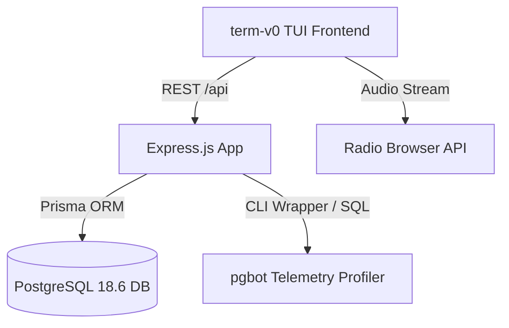

# Design: term-v0 Hackathon Command & Observability System

**Status:** active
**Owner:** @harryphan
**Last updated:** 2026-08-17
**Scope:** System-wide

## Mission

Provide a retro-futuristic, high-productivity terminal interface (`term-v0`) for managing deadlines, sprint deliverables, AI agent discovery tracks, and real-time database observability on BNB Chain.

## Tech Stack

| Layer | Technology | Notes |
|---|---|---|
| Runtime | Node.js 20+ (TypeScript) | ES Modules (`"type": "module"`) |
| Framework | Express.js | Helmet, CORS, REST endpoints |
| ORM / Database | Prisma + PostgreSQL 18.6 | Deployed on Railway |
| Telemetry | pgbot CLI / Native PG introspection | Cache hit ratio, queries, vacuum |
| Frontend | Vanilla CSS + Vanilla JS SPA | `Instrument Serif`, `Geist Mono`, `JetBrains Mono` |

## Architecture

### Components

1. **REST API (`src/routes/`)**: Express controllers managing resources, deadlines, tasks, squad members, and progress summaries.
2. **pgbot Subsystem (`src/routes/pgbotRoutes.ts`)**: Direct database introspection fallback providing cache hit ratios, active query profiles, and dead tuple ratios.
3. **term-v0 Frontend (`public/`)**: Single-page application featuring floating frosted navbar (`rounded-[15px]`), CRT scanline overlay, interactive Agent Advantage Report, Kanban board, and global radio browser.

## Links

- Requirements: [docs/requirements/smart-money-era.md](../requirements/smart-money-era.md)
- Decisions: [docs/decisions/0001-term-v0-architecture.md](../decisions/0001-term-v0-architecture.md)
- Codebase Navigation: [docs/ai/README.md](../ai/README.md)
